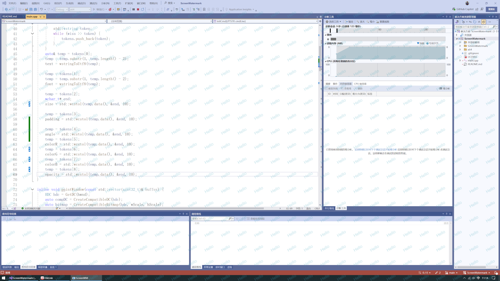

# ScreenWatermark
A tiny, low-resource screen watermarking tool.

# Features

- Extremely lightweight(`1.5MB`).
- Low memory footprint(`4.5MB`).
- No CPU usage.
- Supports multiple monitors.
- Supports high-DPI displays.
- Supports DPIChange event.
- Supports setting system font.
- Supports features such as text color, opacity, rotation angle, text spacing, etc.
- Does not support process watchdog or auto-restart features.



# Download


# Usage

```shell
ScreenWatermark.exe "Hello" "Arial" 16 26 -30 66 166 188 80
```
- `"Hello"` : Watermark text
- `"Arial"` : Font name
- `16` : Font size
- `26` : Text padding
- `-30` : Rotate angle
- `66` : Color red
- `166` : Color green
- `188` : Color blue
- `80` : Color opacity

# Note

Not all system-installed fonts are usable. The following fonts have been tested and confirmed to work:

> 并不是所有系统已安装字体都可以使用，目前已测试可用的字体有：

- SimHei
- SimKai
- SimFang
- Arial (does not support Chinese characters)


